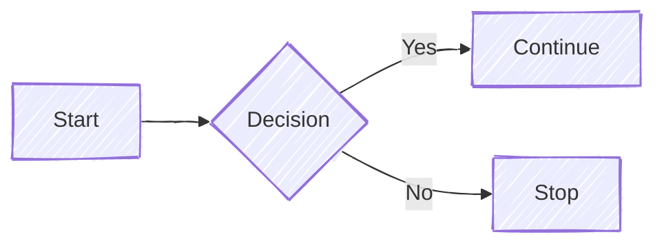

# This is an Extra Page 

This is a graph generated by mermaid:

In Markdown, it is possible to link documentation objects: See [`MyStruct`](::MyStruct)

See this too: [`OtherStruct`](::OtherStruct)
