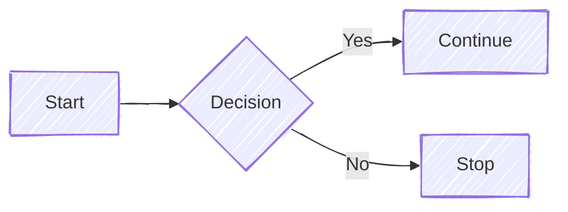

# This is an Extra Page 

This is a graph generated by mermaid:

```mermaid
---
config:
  look: handDrawn
---
flowchart LR
  A[Start] --> B{Decision}
  B -->|Yes| C[Continue]
  B -->|No| D[Stop]
```

In markdown, it is possible to link structs: See [`ExampleStruct`](::ExampleStruct)

See this too: [`OtherStruct`](::OtherStruct)
