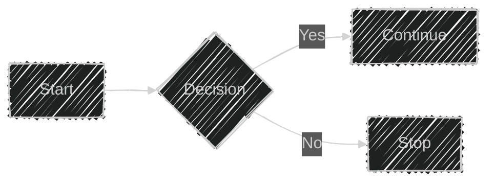

# Getting Started

This is a graph generated by mermaid!

```mermaid
---
config:
  look: handDrawn
  theme: dark 
---
flowchart LR
  A[Start] --> B{Decision}
  B -->|Yes| C[Continue]
  B -->|No| D[Stop]
```

Look Mom, I can link structs: See [`ExampleStruct`](::ExampleStruct)

See this too: [`OtherStruct`](::A::B::OtherStruct)
